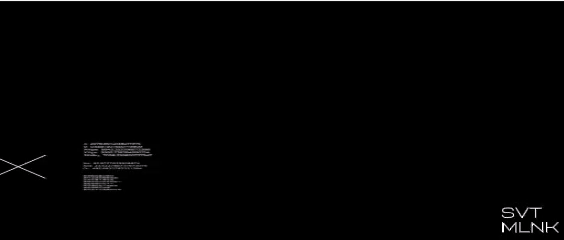

  

##

  
I'm a 21-years-old <b>Frontend developer</b> and self-taught <b>WEB/UX/UI Designer</b>. My responsibility is to create a high-quality, convenient and interactive interface for websites and apps.

Activity:
  - Development 💻
  - Design 🎴

Hobbies:
  - Drawing 🎨
  - Video editing 🎞️
  - Making Animations 🎬 

## Languages and tools

  #### Languages 
   
   
  
  &nbsp; 

  #### Frontend
  
  
   
<!--  -->
  
 <!--  -->
  
  
  

  #### Design
   
   
   
  &nbsp;

  #### DataBase
   
  &nbsp;

  #### Other tools
   
  &nbsp;
  &nbsp;
  &nbsp;
  &nbsp;
  &nbsp;
  

## Projects

  
- HIRO (game): https://github.com/svtmlnk/hiro-game
- All my old projects: https://github.com/svtmlnk/my_old_projects

